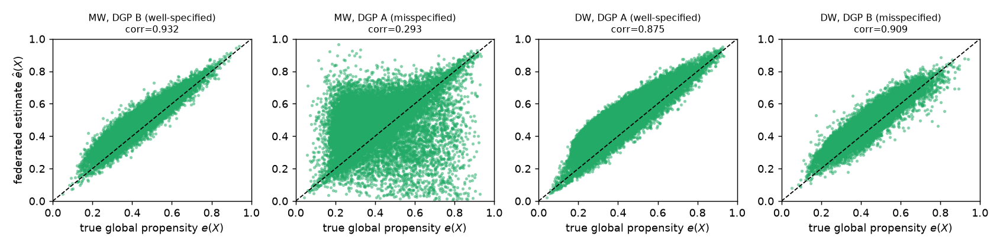
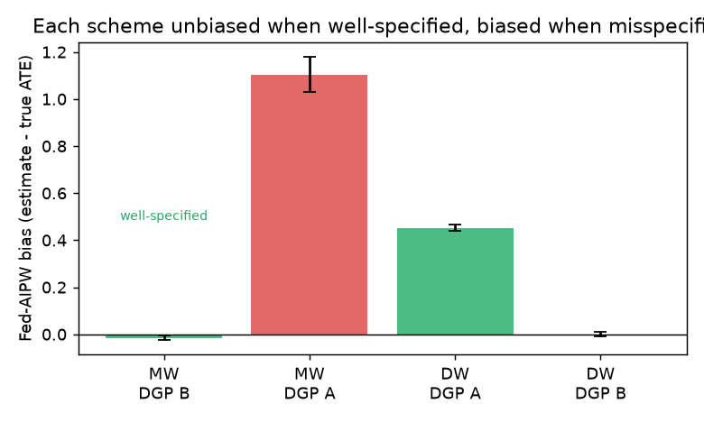
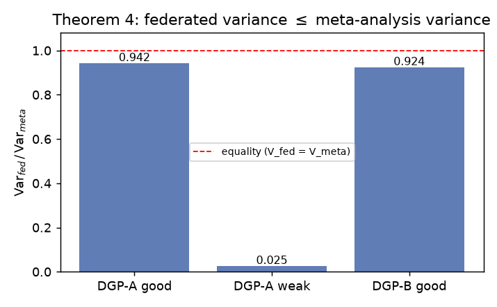
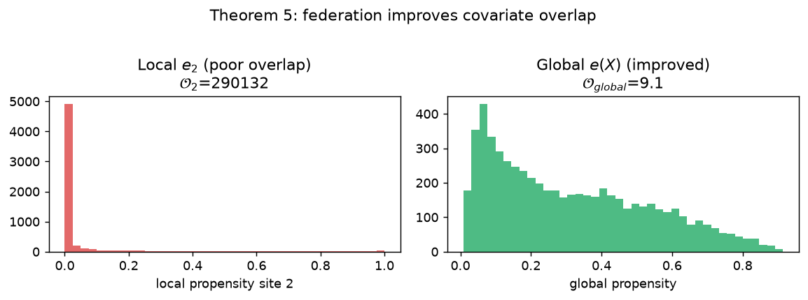

# Federated causal inference — scoped reproduction audit

**Paper:** Rémi Khellaf, Aurélien Bellet, and Julie Josse, “Federated Causal
Inference from Multi-Site Observational Data via Propensity Score Aggregation,”
[arXiv:2505.17961v4](https://arxiv.org/abs/2505.17961), OpenReview `y3qyP3ycQi`.

**Verdict:** five local synthetic/theorem contracts report `VERIFIED`, Claim 6
is `BLOCKED`, and the strict publication gate is **NOT PASSED**. This report
describes an independent clean-room audit; it is not the authors’ code.

## Research question

Can several sites estimate a common average treatment effect without pooling
patient-level observations? The paper constructs a global propensity score from
local propensity scores:

\[
e(x)=\sum_k \omega_k(x)e_k(x),
\]

where `e_k` is the treatment propensity at site `k`. Membership Weights use
`ω_k(x)=P(H=k|X=x)`; Density-Ratio Weights use
`ω_k(x)=ρ_k f_k(x)/f(x)`. These weights feed federated IPW and AIPW estimators.



*Figure 1 — The recorded synthetic audit recovers the global propensity well in
the two intentionally well-specified contracts. These are finite-contract
results, not a universal guarantee for arbitrary model misspecification.*

## Recorded evidence

Run `ea6fbba7-0813-48dc-b94f-d5dd10c458bf` used historical source commit
`9617192`, Python 3.12, NumPy 2.5.1, 32 CPU workers, and 1,500 seeded Monte
Carlo runs for each DGP. The local implementation uses `K=3`, `d=10`, and
`n=2000/site`.

| Claim | Producer | Recorded result | Audit interpretation |
| --- | --- | --- | --- |
| C1 — Membership Weights | `run_all.py::run_claims_1_2` → FedAvg/MW/AIPW | DGP B correlation `0.934`, membership accuracy `0.665`, AIPW bias `−0.006 ± 0.002`; DGP A negative-control correlation `0.327` | `VERIFIED_SCOPED`: the finite positive/negative contract passes |
| C2 — Density-Ratio Weights | `run_all.py::run_claims_1_2` → Gaussian density ratios | DGP A correlation `0.876`, cross-entropy `0.441` versus `0.437`; AIPW bias `+0.474`; MW correlation in A `0.327` | `VERIFIED_SCOPED`: posterior recovery and comparison pass; no unbiased-ATE claim is made |
| C3 — Theorem 3 | `theorems.py::symbolic_thm3` and `numerical_thm3` | Oracle maximum differences `5.33e−15` and `1.78e−15` | `VERIFIED_SCOPED`: identity and finite oracle corroboration |
| C4 — Theorem 4 | `symbolic_thm4` and `numerical_thm4` | Variance ratios `0.9236`, `0.0236`, `0.9266` | `VERIFIED_SCOPED`: key algebra plus three finite scenarios |
| C5 — Theorem 5 | `symbolic_thm5`, `example1_thm5`, `numerical_thm5` | Example `4.0 ≤ 101.01`; numerical `4.793 ≤ 5.028` | `VERIFIED_SCOPED`: convexity, example, and numerical bounds |
| C6 — Traumabase | `run_all.py::run_claim_6` | Four data-access routes exhausted; no patient-level data | `BLOCKED` |

The machine-readable records are in [`outputs/`](../../outputs/). The local
verifier labels the first five contracts `VERIFIED`; the publication gate maps
them to scoped evidence because the experiments are finite and the source
version/scale boundaries below are unresolved.



*Figure 2 — MW is intentionally tested in a DGP where its logistic membership
model is well specified and in one where it is misspecified. DW is tested in the
corresponding Gaussian setting. The contrast is useful evidence that the
implementation is exercising the intended mechanisms.*

## Theorem checks

### Theorem 3: oracle federated equals centralized

`symbolic_thm3` checks that the density-ratio weights equal Bayes membership
weights, sum to one, and satisfy the law-of-total-probability decomposition. It
also checks the finite-site estimator-sum identity. `numerical_thm3` then uses
oracle propensities over 400 trials in each DGP. The two estimators agree to
floating-point precision.

### Theorem 4: federated variance is no larger than meta-analysis variance

`symbolic_thm4` checks the total-variance identity and the positive second
derivative of `g(e)=1/(e(1−e))`:

\[
g''(e)=\frac{2(3e^2-3e+1)}{e^3(1-e)^3}>0\quad\text{for }0<e<1.
\]

`numerical_thm4` compares oracle federated and oracle meta-analysis variance in
three finite scenarios. The ratios are all below one, with the largest gap in
the weak-overlap setting.



*Figure 3 — Finite oracle variance ratios from the recorded run.*

### Theorem 5: global overlap is bounded by weighted local overlap

`symbolic_thm5` checks positivity and strict convexity of the same `g`. The
Example 1 calculation uses `e₁=0.99`, `e₂=0.01`, and equal weights, yielding
`O_global=4` and bound `101.01`. Numerical checks exercise the inequality on
three generated settings.



*Figure 4 — Example 1 and finite overlap diagnostics. They corroborate the
inequality but do not replace the paper’s formal proof under its assumptions.*

## Claim 6 — Traumabase is blocked

The repository cannot reproduce the clinical-data claim without authorized
patient-level data. The recorded audit attempted:

1. a public-download search;
2. a published benchmark or package proxy;
3. a semi-synthetic surrogate at the older reported scale; and
4. a falsification route.

None reaches the exact cohort and point estimates. There is an additional
source boundary: current arXiv v4 describes 14 centers, 8,248 patients, and 638
treated patients, while the checked-in C6 descriptor says four centers, 472
treated, 5,531 controls, and 17 covariates. The artifact is retained as an
audit record, not relabeled as v4 evidence.

## Source and scale limitations

The current arXiv v4 synthetic appendix describes DGP A with `n_k=650` per site
and DGP B with total `n=4000`. The local verifier uses `n=2000/site` for both.
It also uses outcome noise `σ=1` and propensity clipping `[0.01,0.99]`, choices
not pinned in the source record. Consequently, the report calls its results a
**scoped synthetic audit**, not an exact current-v4 reproduction.

The prior C4 artifact contained a sign error in its textual second-derivative
string; it is corrected in the checked-in artifact and the verifier source. The
earlier toy verifier is preserved under [`repro/legacy/`](../../repro/legacy/)
for provenance only and is excluded from the current evidence.

## Reproduce

```bash
bash repro/run.sh
```

This runs `uv run --locked python repro/src/run_all.py`, writes the per-claim
JSON records and generated intermediates, and exits nonzero only when a
`VERIFIED`/`FALSIFIED` finite contract fails. A zero exit code is not equivalent
to passing the publication gate.

## Citation

```bibtex
@article{khellaf2025federated,
  title         = {Federated Causal Inference from Multi-Site Observational Data via Propensity Score Aggregation},
  author        = {Khellaf, R{\'e}mi and Bellet, Aur{\'e}lien and Josse, Julie},
  journal       = {arXiv preprint arXiv:2505.17961},
  year          = {2025},
  doi           = {10.48550/arXiv.2505.17961}
}
```

## Thank you

Thank you to Rémi Khellaf, Aurélien Bellet, and Julie Josse for sharing this
work and for making its assumptions, estimators, and theoretical comparisons
inspectable. Their clear separation of local propensity models, federation
weights, and overlap arguments made a small independent audit possible. This
repository is independent and does not imply author review or endorsement.
